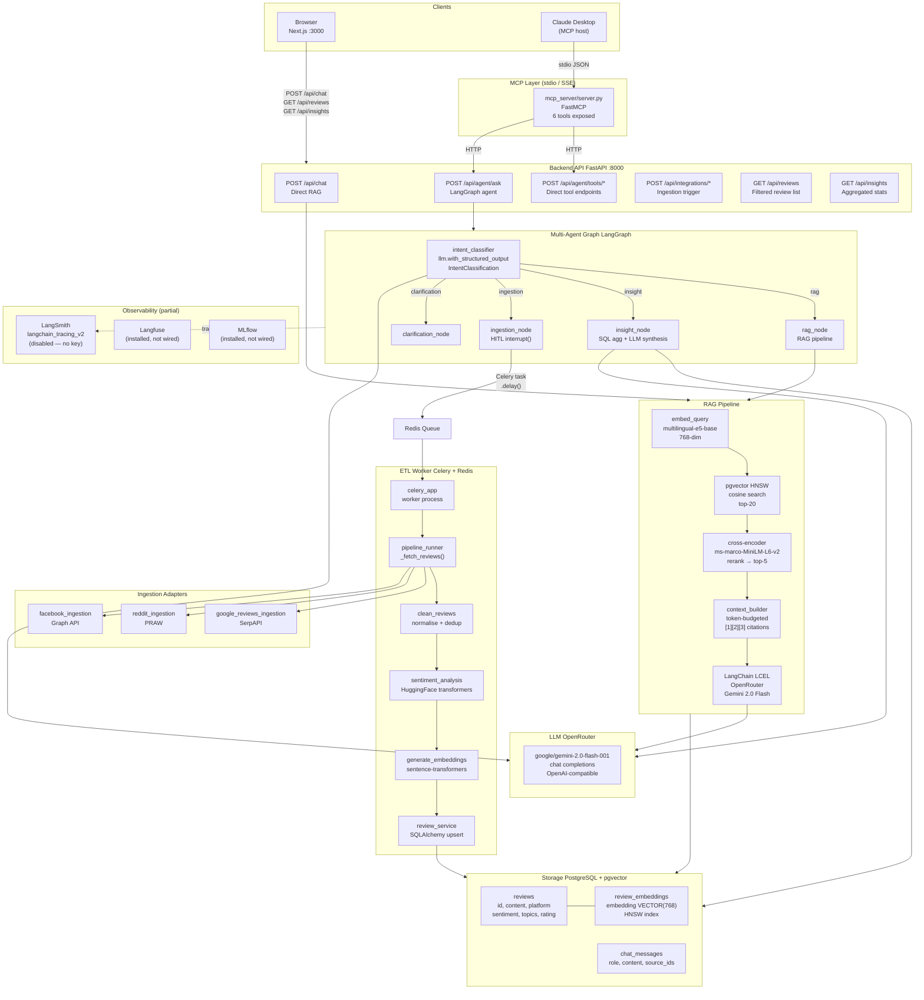
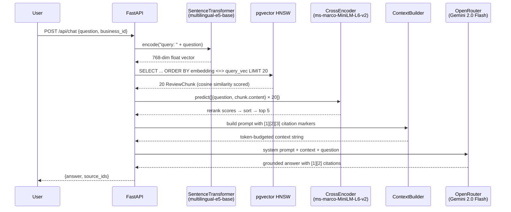
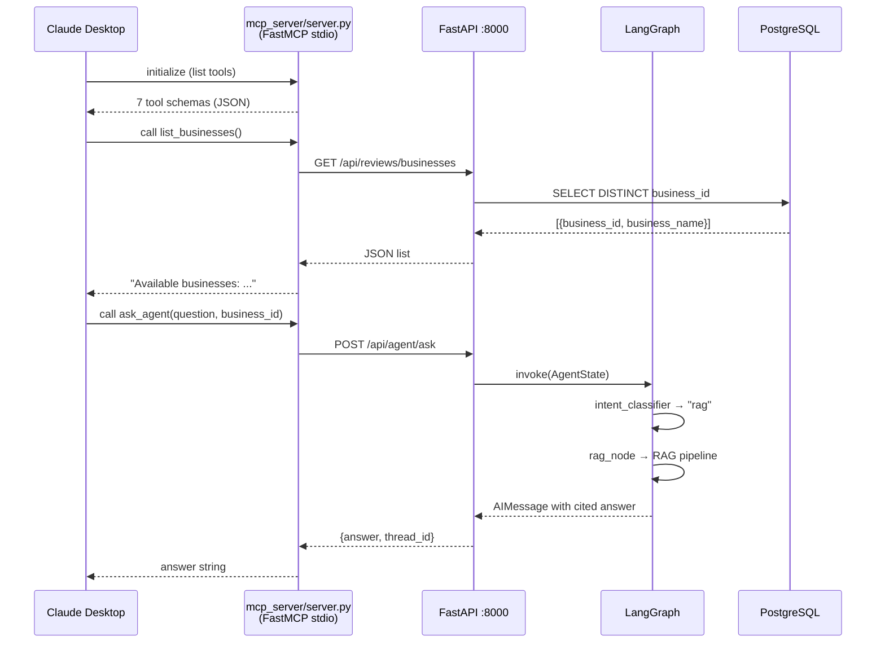
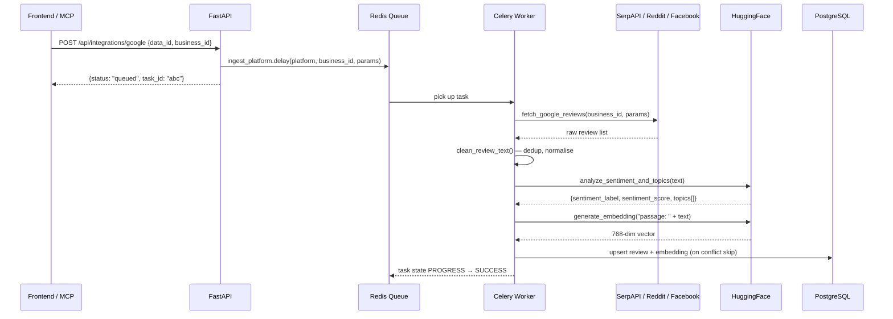
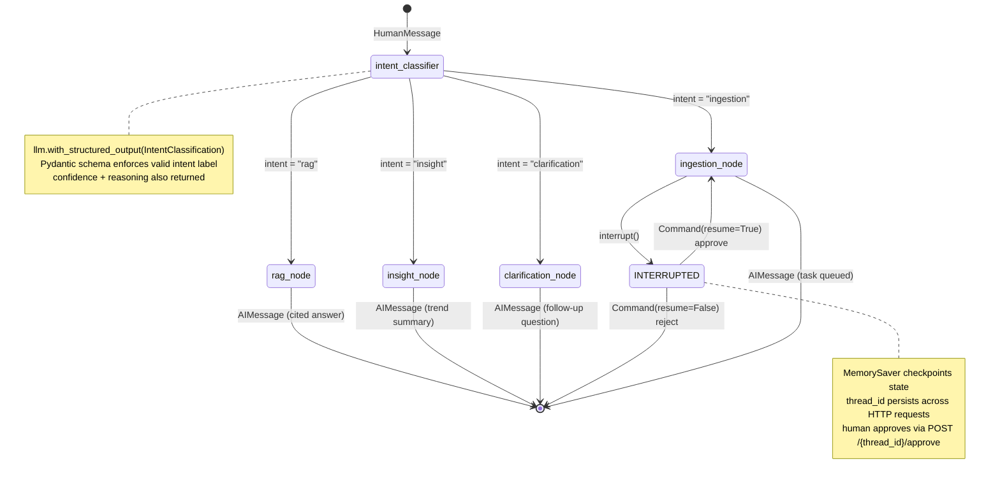

# CustomerVoice AI — System Diagram

## Full Architecture

```mermaid
flowchart TD
    subgraph Clients["Clients"]
        Browser["Browser\nNext.js :3000"]
        ClaudeDesktop["Claude Desktop\n(MCP host)"]
    end

    subgraph MCP["MCP Layer (stdio / SSE)"]
        MCPServer["mcp_server/server.py\nFastMCP\n6 tools exposed"]
    end

    subgraph API["Backend API  FastAPI :8000"]
        RouteChat["POST /api/chat\nDirect RAG"]
        RouteAgent["POST /api/agent/ask\nLangGraph agent"]
        RouteTools["POST /api/agent/tools/*\nDirect tool endpoints"]
        RouteIngest["POST /api/integrations/*\nIngestion trigger"]
        RouteReviews["GET /api/reviews\nFiltered review list"]
        RouteInsights["GET /api/insights\nAggregated stats"]
    end

    subgraph AgentGraph["Multi-Agent Graph  LangGraph"]
        IntentNode["intent_classifier\nllm.with_structured_output\nIntentClassification"]
        RAGNode["rag_node\nRAG pipeline"]
        InsightNode["insight_node\nSQL agg + LLM synthesis"]
        IngestionNode["ingestion_node\nHITL interrupt()"]
        ClarifyNode["clarification_node"]
        IntentNode -->|rag| RAGNode
        IntentNode -->|insight| InsightNode
        IntentNode -->|ingestion| IngestionNode
        IntentNode -->|clarification| ClarifyNode
    end

    subgraph RAGPipeline["RAG Pipeline"]
        Embed["embed_query\nmultilingual-e5-base\n768-dim"]
        PGVector["pgvector HNSW\ncosine search\ntop-20"]
        CrossEnc["cross-encoder\nms-marco-MiniLM-L6-v2\nrerank → top-5"]
        CtxBuilder["context_builder\ntoken-budgeted\n[1][2][3] citations"]
        LLMAnswer["LangChain LCEL\nOpenRouter\nGemini 2.0 Flash"]
        Embed --> PGVector --> CrossEnc --> CtxBuilder --> LLMAnswer
    end

    subgraph ETLWorker["ETL Worker  Celery + Redis"]
        CeleryApp["celery_app\nworker process"]
        Fetcher["pipeline_runner\n_fetch_reviews()"]
        Cleaner["clean_reviews\nnormalise + dedup"]
        Sentiment["sentiment_analysis\nHuggingFace transformers"]
        EmbedGen["generate_embeddings\nsentence-transformers"]
        DBWriter["review_service\nSQLAlchemy upsert"]
        CeleryApp --> Fetcher --> Cleaner --> Sentiment --> EmbedGen --> DBWriter
    end

    subgraph Ingestion["Ingestion Adapters"]
        Google["google_reviews_ingestion\nSerpAPI"]
        Reddit["reddit_ingestion\nPRAW"]
        Facebook["facebook_ingestion\nGraph API"]
    end

    subgraph Storage["Storage  PostgreSQL + pgvector"]
        ReviewsTable["reviews\nid, content, platform\nsentiment, topics, rating"]
        EmbeddingsTable["review_embeddings\nembedding VECTOR(768)\nHNSW index"]
        ChatTable["chat_messages\nrole, content, source_ids"]
        ReviewsTable --- EmbeddingsTable
    end

    subgraph Observability["Observability (partial)"]
        LangSmith["LangSmith\nlangchain_tracing_v2\n(disabled — no key)"]
        Langfuse["Langfuse\n(installed, not wired)"]
        MLflow["MLflow\n(installed, not wired)"]
    end

    subgraph LLM["LLM  OpenRouter"]
        Gemini["google/gemini-2.0-flash-001\nchat completions\nOpenAI-compatible"]
    end

    Browser -->|"POST /api/chat\nGET /api/reviews\nGET /api/insights"| API
    ClaudeDesktop -->|stdio JSON| MCPServer
    MCPServer -->|HTTP| RouteTools
    MCPServer -->|HTTP| RouteAgent

    RouteChat --> RAGPipeline
    RouteAgent --> AgentGraph
    RAGNode --> RAGPipeline
    InsightNode --> Storage
    IngestionNode -->|"Celery task\n.delay()"| CeleryWorkerQ

    CeleryWorkerQ["Redis Queue"] --> CeleryApp
    Fetcher --> Google
    Fetcher --> Reddit
    Fetcher --> Facebook

    RAGPipeline --> Storage
    DBWriter --> Storage
    LLMAnswer --> LLM
    IntentNode --> LLM
    InsightNode --> LLM

    AgentGraph -.->|traces| LangSmith
```

---

## RAG Pipeline Detail

```mermaid
sequenceDiagram
    participant User
    participant API as FastAPI
    participant Embed as SentenceTransformer<br/>(multilingual-e5-base)
    participant PG as pgvector HNSW
    participant CE as CrossEncoder<br/>(ms-marco-MiniLM-L6-v2)
    participant CTX as ContextBuilder
    participant LLM as OpenRouter<br/>(Gemini 2.0 Flash)

    User->>API: POST /api/chat {question, business_id}
    API->>Embed: encode("query: " + question)
    Embed-->>API: 768-dim float vector
    API->>PG: SELECT ... ORDER BY embedding <=> query_vec LIMIT 20
    PG-->>API: 20 ReviewChunk (cosine similarity scored)
    API->>CE: predict([(question, chunk.content) × 20])
    CE-->>API: rerank scores → sort → top 5
    API->>CTX: build prompt with [1][2][3] citation markers
    CTX-->>API: token-budgeted context string
    API->>LLM: system prompt + context + question
    LLM-->>API: grounded answer with [1][2] citations
    API-->>User: {answer, source_ids}
```

---

## MCP Tool Call Flow

```mermaid
sequenceDiagram
    participant Claude as Claude Desktop
    participant MCP as mcp_server/server.py<br/>(FastMCP stdio)
    participant API as FastAPI :8000
    participant Graph as LangGraph
    participant PG as PostgreSQL

    Claude->>MCP: initialize (list tools)
    MCP-->>Claude: 7 tool schemas (JSON)

    Claude->>MCP: call list_businesses()
    MCP->>API: GET /api/reviews/businesses
    API->>PG: SELECT DISTINCT business_id
    PG-->>API: [{business_id, business_name}]
    API-->>MCP: JSON list
    MCP-->>Claude: "Available businesses: ..."

    Claude->>MCP: call ask_agent(question, business_id)
    MCP->>API: POST /api/agent/ask
    API->>Graph: invoke(AgentState)
    Graph->>Graph: intent_classifier → "rag"
    Graph->>Graph: rag_node → RAG pipeline
    Graph-->>API: AIMessage with cited answer
    API-->>MCP: {answer, thread_id}
    MCP-->>Claude: answer string
```

---

## Ingestion + ETL Flow

```mermaid
sequenceDiagram
    participant UI as Frontend / MCP
    participant API as FastAPI
    participant Redis as Redis Queue
    participant Worker as Celery Worker
    participant Src as SerpAPI / Reddit / Facebook
    participant NLP as HuggingFace
    participant PG as PostgreSQL

    UI->>API: POST /api/integrations/google {data_id, business_id}
    API->>Redis: ingest_platform.delay(platform, business_id, params)
    API-->>UI: {status: "queued", task_id: "abc"}

    Redis->>Worker: pick up task
    Worker->>Src: fetch_google_reviews(business_id, params)
    Src-->>Worker: raw review list
    Worker->>Worker: clean_review_text() — dedup, normalise
    Worker->>NLP: analyze_sentiment_and_topics(text)
    NLP-->>Worker: {sentiment_label, sentiment_score, topics[]}
    Worker->>NLP: generate_embedding("passage: " + text)
    NLP-->>Worker: 768-dim vector
    Worker->>PG: upsert review + embedding (on conflict skip)
    Worker-->>Redis: task state PROGRESS → SUCCESS
```

---

## LangGraph State Machine

```mermaid
stateDiagram-v2
    [*] --> intent_classifier: HumanMessage
    intent_classifier --> rag_node: intent = "rag"
    intent_classifier --> insight_node: intent = "insight"
    intent_classifier --> ingestion_node: intent = "ingestion"
    intent_classifier --> clarification_node: intent = "clarification"
    rag_node --> [*]: AIMessage (cited answer)
    insight_node --> [*]: AIMessage (trend summary)
    clarification_node --> [*]: AIMessage (follow-up question)
    ingestion_node --> INTERRUPTED: interrupt()
    INTERRUPTED --> ingestion_node: Command(resume=True) approve
    INTERRUPTED --> [*]: Command(resume=False) reject
    ingestion_node --> [*]: AIMessage (task queued)

    note right of intent_classifier
        llm.with_structured_output(IntentClassification)
        Pydantic schema enforces valid intent label
        confidence + reasoning also returned
    end note

    note right of INTERRUPTED
        MemorySaver checkpoints state
        thread_id persists across HTTP requests
        human approves via POST /{thread_id}/approve
    end note
```
